# MiniBlog
Este projeto eu fiz para aprimorar e fixar mais conhecimentos em React, a ideia é criar um Mini Blog onde terá um fluxo de login e autentificação e o usuario poderá fazer postagens, assim como um fluxo administrador para poder gerenciar as postagens.


 
 


**MiniBlog** Em breve...


Este projeto foi desenvolvido com **React + JavaScript** como parte do meu aprendizado prático para reforçar conceitos essenciais de desenvolvimento front-end com **React**.


---


## 🕹️ Como funciona o MiniBlog?

- Em breve...
- ...
- ...
- ...


## 📸 Capturas de Tela


### 🖼️ Home Page
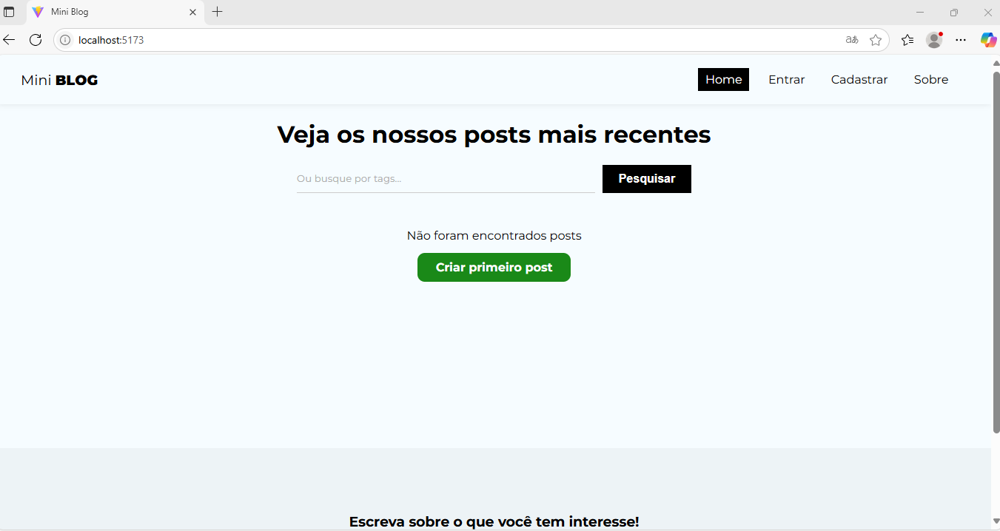

### 🖼️ Sign-in
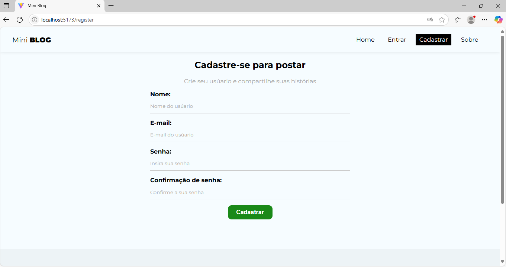

### 🖼️ Error in Sign-in 1
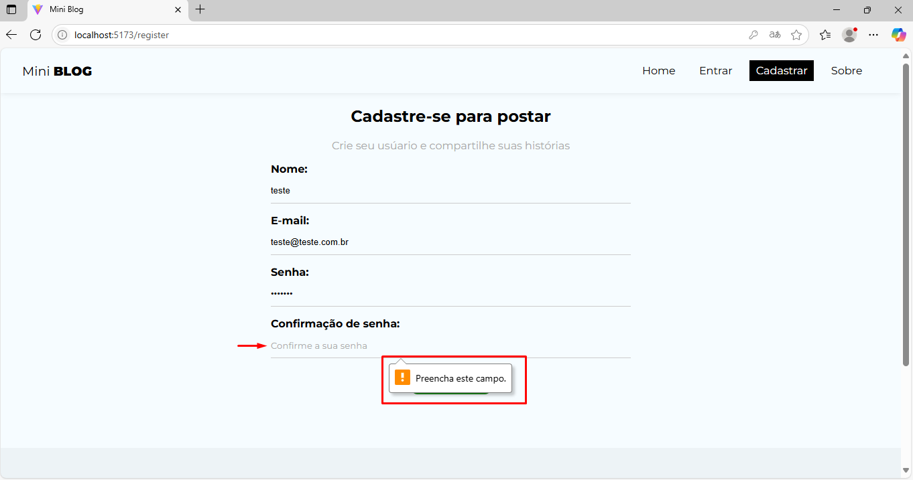

### 🖼️ Error in Sign-in 2


### 🖼️ User in Firebase
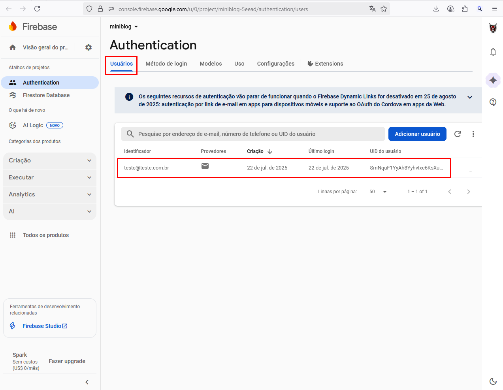

### 🖼️ Login Page
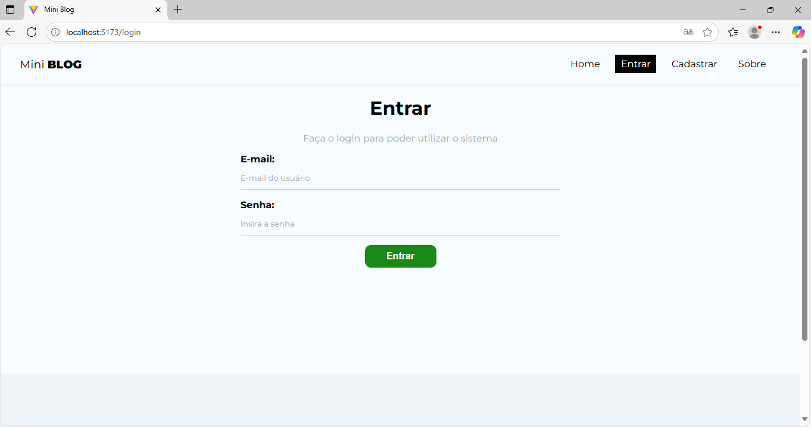

### 🖼️ About Page
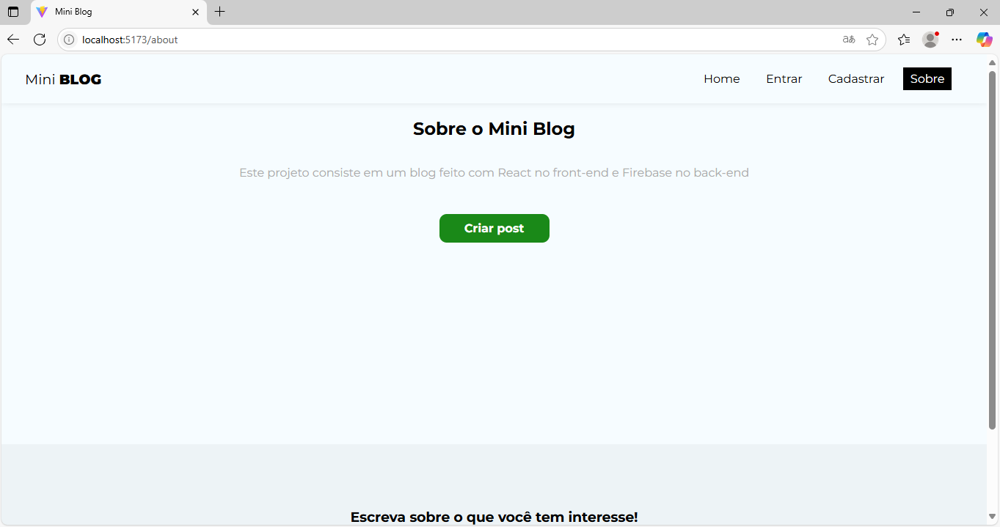

### 🖼️ Create Post
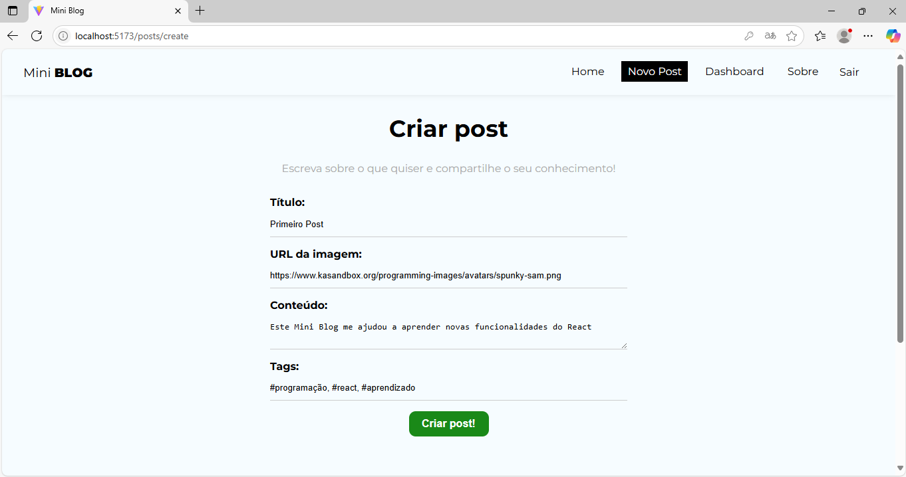

### 🖼️ Post in Firebase
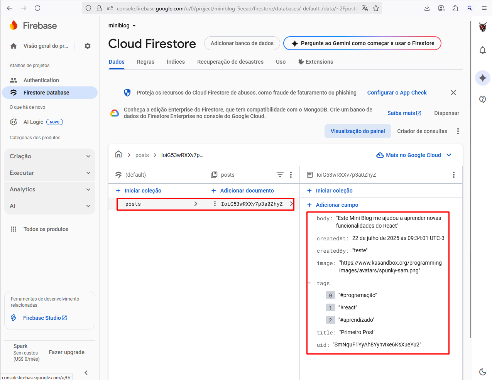

### 🖼️ Home Page after Post
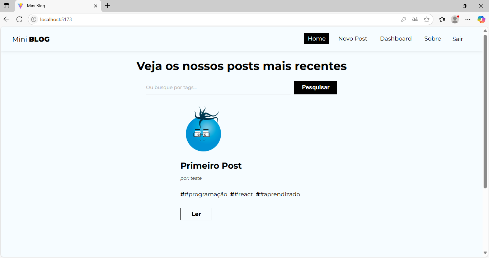

### 🖼️ Read Post
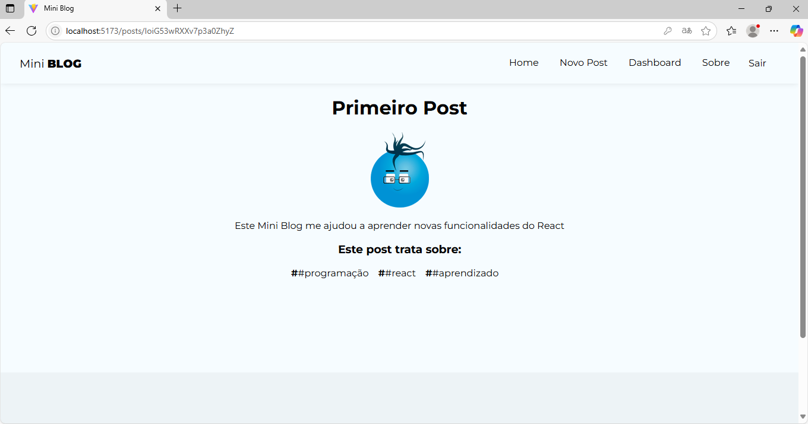

### 🖼️ Dashboard Post
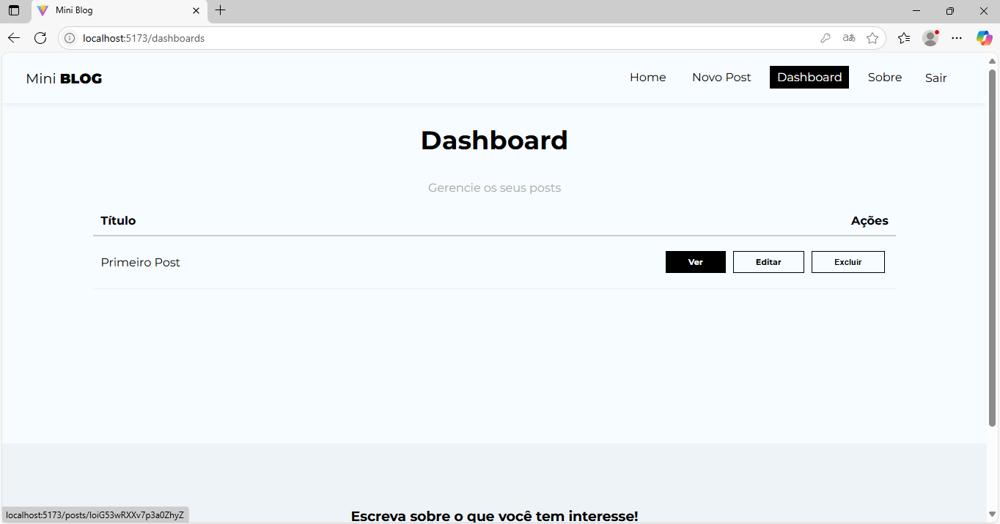

### 🖼️ Edit Post
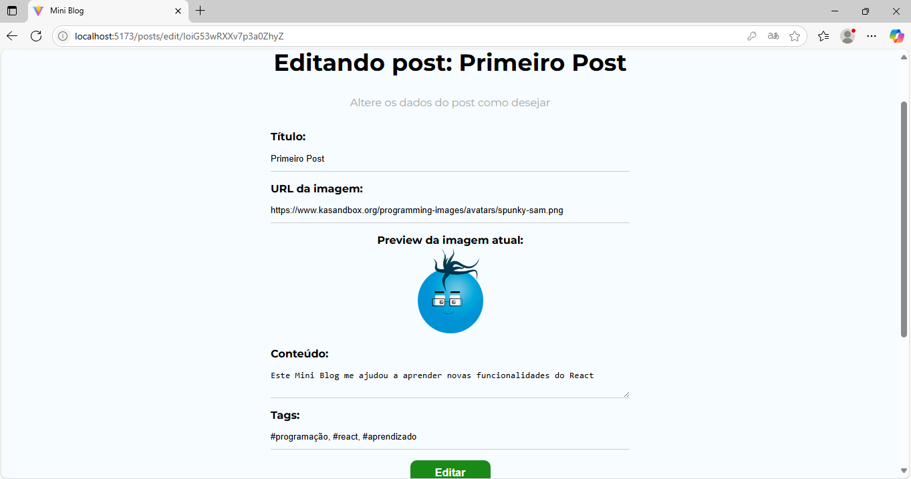

### 🖼️ Delete Post
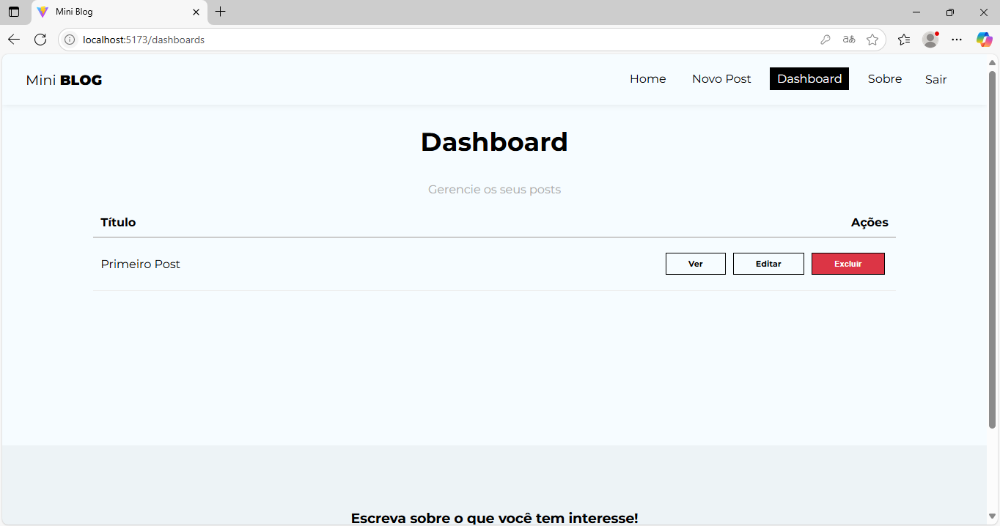


## 🚀 Tecnologias utilizadas

- ⚛️ **React** (com Vite)
- 🟨 **JavaScript (ES6+)**
- 💅 **CSS Modules** para estilização
- 📦 **Vite** como bundler

---

## 📦 Como executar o projeto

1. Clone o repositório:
   ```bash
   git clone https://github.com/KlausKurth/MiniBlog.git
   cd miniblog   
   npm run dev


2. Adicione suas configurações do Firebase em "C:\Users\User\MiniBlog\miniblog\src\firebase\config.jsx"
    

---


## ✍️ Autor

Desenvolvido com 💙 por **[Klaus Christian Kurth](https://github.com/KlausKurth)**  
📧 klausckurth@gmail.com  
🔗 [LinkedIn](https://www.linkedin.com/in/klaus-christian-kurth-soares-039937164/) 